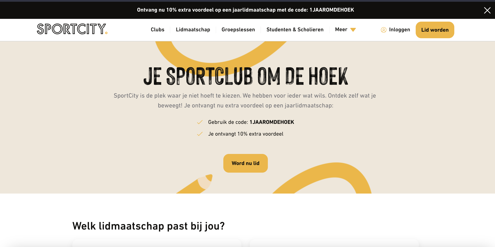
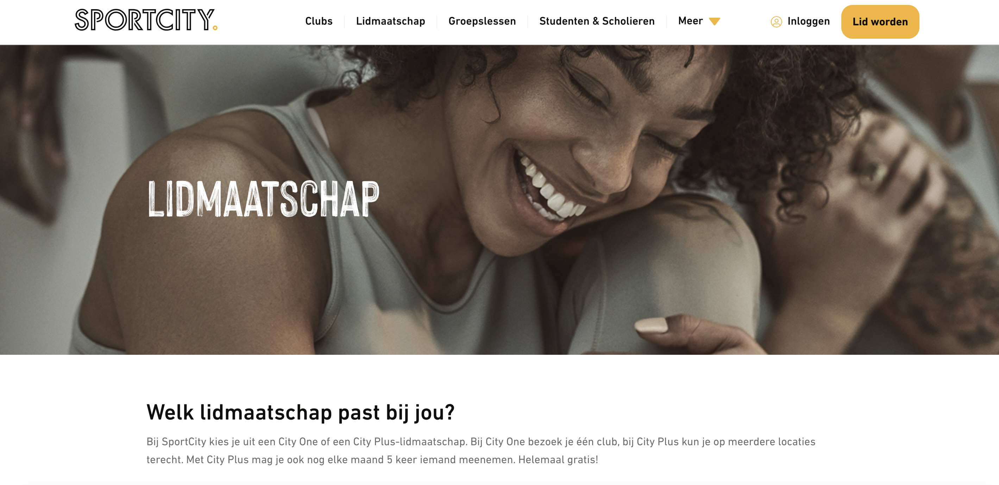

# Procesverslag
Markdown is een simpele manier om HTML te schrijven.  
Markdown cheat cheet: [Hulp bij het schrijven van Markdown](https://github.com/adam-p/markdown-here/wiki/Markdown-Cheatsheet).

Nb. De standaardstructuur en de spartaanse opmaak van de README.md zijn helemaal prima. Het gaat om de inhoud van je procesverslag. Besteedt de tijd voor pracht en praal aan je website.

Nb. Door *open* toe te voegen aan een *details* element kun je deze standaard open zetten. Fijn om dat steeds voor de relevante stuk(ken) te doen.

## Jij

  
uitwerken voor kick-off werkgroep

  ### Auteur:
  Laura Mostert

  #### Je startniveau:
 Blauw 

  #### Je focus:
Surface Plane

## Je website

  
uitwerken voor kick-off werkgroep

  ### Je opdracht:
  [https://www.sportcity.nl/](https://www.sportcity.nl/)

  #### Screenshot(s) van de eerste pagina (small screen): 
  Sportcity
  

  #### Screenshot(s) van de tweede pagina (small screen):
  hier de naam van de pagina  
  
 

## Toegankelijkheidstest 1/2 (week 1)

  
uitwerken na test in 2e werkgroep

  ### Bevindingen
  Lijst met je bevindingen die in de test naar voren kwamen:

## Breakdownschets (week 1)

  
uitwerken na afloop 3e werkgroep

  ### de hele pagina: 
  

  ### dynamisch deel (bijv menu): 
  

  ### wellicht nog een dynamisch deel (bijv filter): 
  

## Voortgang 1 (week 2)

  
uitwerken voor 1e voortgang

Stand van zaken Dan
Ik vind het nog vrij moeilijk om overzicht te houden over de parents en de childs. Als ik helemaal nieuwe code schrijf dan lukt het me niet om het overzicht te houden omdat nog niet alle veranderingen te zien zijn. Het aanpassen van de opdrachten voor het gebruik van de website werkt wel maar ik vind het moeilijk om daar verder op te borduren. Hierdoor bleef ik heel erg vast zitten met het schrijven van de HTML.

https://codepen.io/DanNaumannHvA/pen/eYbyVRN

Stand van zaken Laura
Mijn HTML code is redelijk uitgebereid en ik heb zelfs al CSS toegepast. Ik loop echter met simpele zaken nog een beetje vast (lees: ik heb dit gewoon nog niet correct toegepast), maar ik heb nog niet de tijd genomen om hier goed voor te zitten en hierover te Googlen. Wanneer ik écht vast loop zal ik vragen stellen.

Agenda voor meeting
Vragen over het gebruik van afbeeldingen: Moet dit in de CSS of mag dit in de HTML.
Hoeveel delen/sections moet je minimaal hebben van de website.

maak van articles, sections
Je mag geen classes gebruiken, alleen nth of type

Achtergronden in CSS, afbeeldingen in HTML.

## Voortgang 2 (week 3)

  
uitwerken voor 2e voortgang

  ### Stand van zaken
  ik krijg de artikelen niet per se goed naast elkaar, maar als ik er nog net iets langer aan zit zal het wel lukken. Verder zit ik goed op schema.

  ### Agenda voor meeting
  samen met je groepje opstellen

mn website gebruikt geen javascript hoe moet ik dan js toepassen

  ### Verslag van meeting
  hier na afloop snel de uitkomsten van de meeting vastleggen

  - punt 1
  - punt 2
  - nog een punt
- ...

## Toegankelijkheidstest 2/2 (week 4)

  
uitwerken na test in 9e werkgroep

  ### Bevindingen
  Lijst met je bevindingen die in de test naar voren kwamen (geef ook aan wat er verbeterd is):

## Voortgang 3 (week 4)

  
uitwerken voor 3e voortgang

  ### Stand van zaken
  hier dit ging goed & dit was lastig (neem ook screenshots op van delen van je website en code)
https://codepen.io/laura-louise/pen/poqxzQP

  ### Agenda voor meeting
  samen met je groepje opstellen

  | student 1      | student 2          | student 3    | student 4        |
  | ---            | ---                | ---          | ---              |
  | dit bespreken  | en dit             | en ik dit    | en dan ik dat    |
  | en dat ook nog | dit als er tijd is | nog een punt | dit wil ik zeker |
  | ...            | ...                | ...          | ...              |

  ### Verslag van meeting
  hier na afloop snel de uitkomsten van de meeting vastleggen

  - punt 1
  - punt 2
  - nog een punt
  - ...

## Eindgesprek (week 5)

  
uitwerken voor eindgesprek

  ### Je uitkomst - karakteristiek screenshots:
  

  ### Dit ging goed/Heb ik geleerd: 
  Korte omschrijving met plaatjes

  

  ### Dit was lastig/Is niet gelukt:
  Korte omschrijving met plaatjes

  

## Bronnenlijst

  
continu bijhouden terwijl je werkt

  Nb. Wees specifiek ('css-tricks' als bron is bijv. niet specifiek genoeg). 
  Nb. ChatGpT en andere AI horen er ook bij.
  Nb. Vermeld de bronnen ook in je code.

  1. bron 1
  2. bron 2
  3. ...

